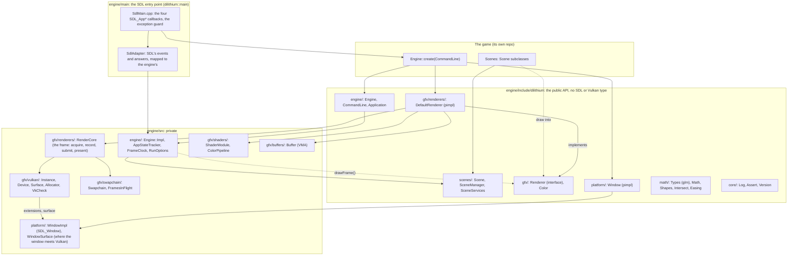

# Architecture

Dilithium2D is a library a game links. The game writes scenes and one function, `Engine::create`, that builds a
window, a renderer and the engine from them; SDL's entry point (`dilithium::main`) drives the engine one frame per
callback. The design mirrors LiquidMetal2D (Swift/Metal): the same pieces under the same names, in C++ on Vulkan.

This diagram is drawn by hand and says what the layers are meant to be. The pages under `generated/` are drawn
from the code by `tools/diagrams.sh` and say what it is; when the two disagree, one of them is wrong.

Rules the layering rests on (`CLAUDE.md` has the full list):

- A game includes only `engine/include`. Nothing there names SDL, Vulkan or VMA; glm is the one public dependency,
  for the math types. `tests/headers/` compiles each public header alone to prove it.
- SDL stays in `platform/` and `main/`, Vulkan and VMA in `gfx/`. Graphics asks the window for its instance
  extensions and its surface (`platform/WindowSurface`); `tools/check-layers.sh` greps for both on every `ctest`.
- The engine never shows UI and never quits on its own: it asks the scene (`quitRequested`), tells it
  (`appStateChanged`), and the game decides.
- Members are declared in creation order, so teardown is the reverse with no code for it: scenes, then the
  renderer, then the window.

## Generated pages

| Page | What it shows |
|---|---|
| [`generated/layers.md`](generated/layers.md) | the folders of `engine/` as packages, with the dependency arrows the code has |
| [`generated/public_api.md`](generated/public_api.md) | every public class, with inheritance and ownership |
| [`generated/renderer_stack.md`](generated/renderer_stack.md) | `Renderer` → `DefaultRenderer` → `RenderCore` → the Vulkan pieces |
| [`generated/frame.md`](generated/frame.md) | one frame as a sequence, from `SdlAdapter::iterate` down |
| [`generated/includes.md`](generated/includes.md) | who includes whom |

Regenerate with `tools/diagrams.sh` after an API change (needs a debug build and `brew install clang-uml`).
