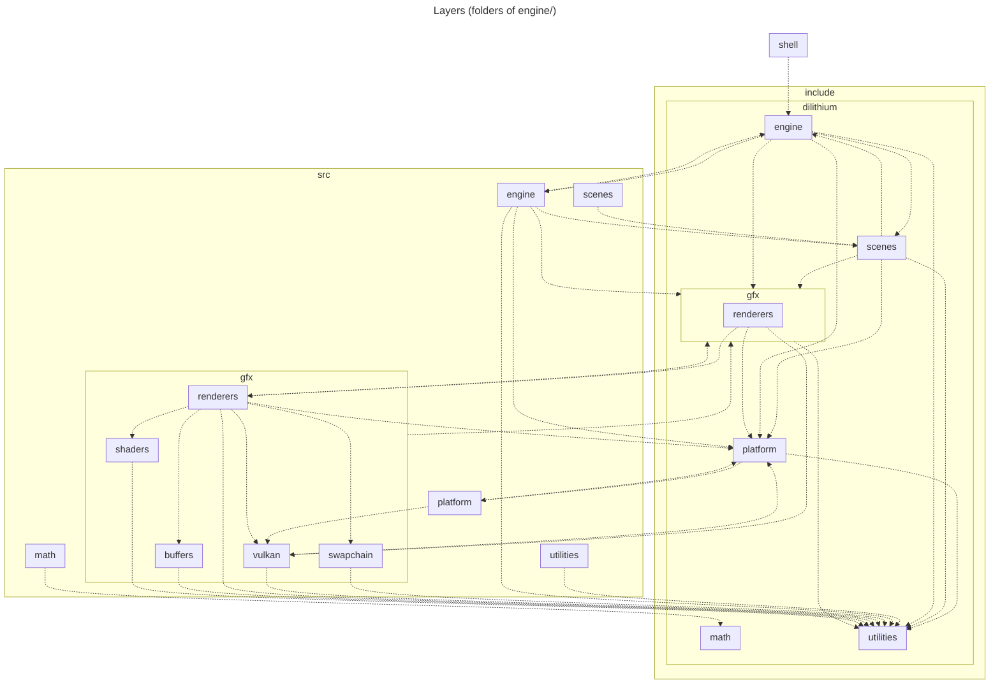

# Layers (folders of engine/)

Generated from the code by `tools/diagrams.sh` (clang-uml). Do not edit; regenerate.

```mermaid
---
title: Layers (folders of engine/)
---
flowchart
    subgraph C_0012809092572990289391[include]
    subgraph C_0012577257405327163239[dilithium]
    subgraph C_0006298341999832860390[platform]
    end
    subgraph C_0008414304222372601029[utilities]
    end
    subgraph C_0006377284217044718053[scenes]
    end
    subgraph C_0017825392617274527979[math]
    end
    subgraph C_0003542656463181301996[engine]
    end
    subgraph C_0003901156776538314640[gfx]
    subgraph C_0017663372143550190399[renderers]
    end
    end
    end
    end
    subgraph C_0010654316019790784920[src]
    subgraph C_0014822937323245241197[scenes]
    end
    subgraph C_0007071731057941935089[platform]
    end
    subgraph C_0010233608232007854375[math]
    end
    subgraph C_0013524850851676760114[utilities]
    end
    subgraph C_0015421901025311985358[engine]
    end
    subgraph C_0000870633202236785065[gfx]
    subgraph C_0004804608036888100374[swapchain]
    end
    subgraph C_0011729562870360606892[vulkan]
    end
    subgraph C_0018135243476833536659[renderers]
    end
    subgraph C_0005196780557443478016[buffers]
    end
    subgraph C_0016936712551952591823[shaders]
    end
    end
    end
    subgraph C_0012613613939667938803[shell]
    end
    C_0006298341999832860390 -.-> C_0007071731057941935089
    C_0006298341999832860390 -.-> C_0008414304222372601029
    C_0006377284217044718053 -.-> C_0006298341999832860390
    C_0006377284217044718053 -.-> C_0008414304222372601029
    C_0006377284217044718053 -.-> C_0003901156776538314640
    C_0006377284217044718053 -.-> C_0003542656463181301996
    C_0003542656463181301996 -.-> C_0006377284217044718053
    C_0003542656463181301996 -.-> C_0003901156776538314640
    C_0003542656463181301996 -.-> C_0006298341999832860390
    C_0003542656463181301996 -.-> C_0008414304222372601029
    C_0003542656463181301996 -.-> C_0015421901025311985358
    C_0003901156776538314640 -.-> C_0008414304222372601029
    C_0017663372143550190399 -.-> C_0006298341999832860390
    C_0017663372143550190399 -.-> C_0018135243476833536659
    C_0017663372143550190399 -.-> C_0011729562870360606892
    C_0014822937323245241197 -.-> C_0006377284217044718053
    C_0007071731057941935089 -.-> C_0006298341999832860390
    C_0007071731057941935089 -.-> C_0011729562870360606892
    C_0010233608232007854375 -.-> C_0017825392617274527979
    C_0013524850851676760114 -.-> C_0008414304222372601029
    C_0015421901025311985358 -.-> C_0006298341999832860390
    C_0015421901025311985358 -.-> C_0003901156776538314640
    C_0015421901025311985358 -.-> C_0006377284217044718053
    C_0015421901025311985358 -.-> C_0003542656463181301996
    C_0015421901025311985358 -.-> C_0008414304222372601029
    C_0000870633202236785065 -.-> C_0003901156776538314640
    C_0004804608036888100374 -.-> C_0008414304222372601029
    C_0011729562870360606892 -.-> C_0008414304222372601029
    C_0011729562870360606892 -.-> C_0006298341999832860390
    C_0018135243476833536659 -.-> C_0011729562870360606892
    C_0018135243476833536659 -.-> C_0004804608036888100374
    C_0018135243476833536659 -.-> C_0006298341999832860390
    C_0018135243476833536659 -.-> C_0003901156776538314640
    C_0018135243476833536659 -.-> C_0008414304222372601029
    C_0018135243476833536659 -.-> C_0005196780557443478016
    C_0018135243476833536659 -.-> C_0016936712551952591823
    C_0005196780557443478016 -.-> C_0008414304222372601029
    C_0016936712551952591823 -.-> C_0008414304222372601029
    C_0012613613939667938803 -.-> C_0003542656463181301996
```
