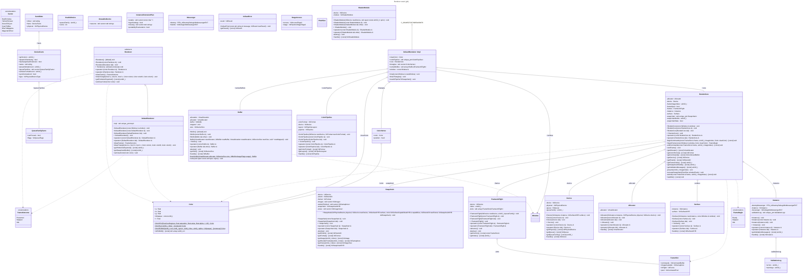

# Renderer stack (gfx)

Generated from the code by `tools/diagrams.sh` (clang-uml). Do not edit; regenerate.

```mermaid
---
title: Renderer stack (gfx)
---
classDiagram
    class C_0014381799943743737761["FrameOutcome"]
    class C_0014381799943743737761 {
        <<enumeration>>
        Presented
        Skipped
        Idle
    }
    class C_0002210481607728283061["Renderer"]
    class C_0002210481607728283061 {
        <<abstract>>
        +Renderer() [default] void
        +Renderer(const Renderer &) void
        +Renderer(Renderer &&) void
        +~Renderer() [default,constexpr] void
        +operator=(const Renderer &) Renderer &
        +operator=(Renderer &&) Renderer &
        +drawFrame() FrameOutcome*
        +drawTriangle(Vec2 a, Vec2 b, Vec2 c, Color colorA, Color colorB, Color colorC) void*
        +getProblemsReported() [const] uint32_t
        +setClearColor(Color color) void*
    }
    class C_0014652720749054439479["DefaultRenderer"]
    class C_0014652720749054439479 {
        +DefaultRenderer(const Window & window) void
        +DefaultRenderer(const DefaultRenderer &) void
        +DefaultRenderer(DefaultRenderer &&) void
        +~DefaultRenderer() void
        +operator=(const DefaultRenderer &) DefaultRenderer &
        +operator=(DefaultRenderer &&) DefaultRenderer &
        +drawFrame() FrameOutcome
        +drawTriangle(Vec2 a, Vec2 b, Vec2 c, Color colorA, Color colorB, Color colorC) void
        +getProblemsReported() [const] uint32_t
        +getSwapchainBuilds() [const] uint32_t
        +setClearColor(Color color) void
        -impl : std::unique_ptr&lt;Impl&gt;
    }
    class C_0003444073062530109576["Color"]
    class C_0003444073062530109576 {
        +fromHSV(float hueDegrees, float saturation, float value, float alpha = 1.0f) Color$
        +fromHex(uint32_t rgba) [constexpr] Color$
        +fromRGBA8(uint8_t red, uint8_t green, uint8_t blue, uint8_t alpha = kOpaque) [constexpr] Color$
        +toRGBA8() [const] std::array&lt;uint8_t,4&gt;
        +a : float
        +b : float
        +g : float
        +kOpaque : const uint8_t
        +r : float
    }
    class C_0003019390532495857460["Sector"]
    class C_0003019390532495857460 {
        <<enumeration>>
        RedToYellow
        YellowToGreen
        GreenToCyan
        CyanToBlue
        BlueToMagenta
        MagentaToRed
    }
    class C_0015272475129929318899["Swapchain"]
    class C_0015272475129929318899 {
        +Swapchain(VkPhysicalDevice physical, VkDevice newDevice, VkSurfaceKHR surface, const VkSurfaceCapabilitiesKHR & capabilities, VkExtent2D newExtent, VkSwapchainKHR oldSwapchain) void
        +Swapchain(const Swapchain &) void
        +Swapchain(Swapchain &&) void
        +~Swapchain() void
        +operator=(const Swapchain &) Swapchain &
        +operator=(Swapchain &&) Swapchain &
        -destroy() void
        +getExtent() [const] VkExtent2D
        +getFormat() [const] VkFormat
        +getImage(uint32_t index) [const] VkImage
        +getRenderFinished(uint32_t index) [const] VkSemaphore
        +getView(uint32_t index) [const] VkImageView
        +handle() [const] VkSwapchainKHR
        -device : VkDevice
        -extent : VkExtent2D
        -format : VkFormat
        -images : std::vector&lt;VkImage&gt;
        -renderFinished : std::vector&lt;VkSemaphore&gt;
        -swapchain : VkSwapchainKHR
        -views : std::vector&lt;VkImageView&gt;
    }
    class C_0016878377217761267911["FrameSlot"]
    class C_0016878377217761267911 {
        +commands : VkCommandBuffer
        +imageAvailable : VkSemaphore
        +inFlight : VkFence
        +pool : VkCommandPool
    }
    class C_0003143616909599567436["FramesInFlight"]
    class C_0003143616909599567436 {
        +FramesInFlight(VkDevice newDevice, uint32_t queueFamily) void
        +FramesInFlight(const FramesInFlight &) void
        +FramesInFlight(FramesInFlight &&) void
        +~FramesInFlight() void
        +operator=(const FramesInFlight &) FramesInFlight &
        +operator=(FramesInFlight &&) FramesInFlight &
        +advance() void
        -destroy() void
        +getCurrent() [const] const FrameSlot &
        +getIndex() [const] uint32_t
        -device : VkDevice
        -index : uint32_t
        -slots : std::array&lt;FrameSlot,kFramesInFlight&gt;
    }
    class C_0006970481197969800549["Window"]
    class C_0006970481197969800549 {
    }
    class C_0009549682339495671617["Device"]
    class C_0009549682339495671617 {
        +Device(VkInstance instance, VkSurfaceKHR surface) void
        +Device(const Device &) void
        +Device(Device &&) void
        +~Device() void
        +operator=(const Device &) Device &
        +operator=(Device &&) Device &
        +getPhysical() [const] VkPhysicalDevice
        +getQueue() [const] VkQueue
        +getQueueFamily() [const] uint32_t
        +handle() [const] VkDevice
        -device : VkDevice
        -physical : VkPhysicalDevice
        -queue : VkQueue
        -queueFamily : uint32_t
    }
    class C_0015493281469269219470["Candidate"]
    class C_0015493281469269219470 {
        +driver : std::string
        +facts : DeviceFacts
        +physical : VkPhysicalDevice
    }
    class C_0011954012887602940861["Allocator"]
    class C_0011954012887602940861 {
        +Allocator(VkInstance instance, VkPhysicalDevice physical, VkDevice device) void
        +Allocator(const Allocator &) void
        +Allocator(Allocator &&) void
        +~Allocator() void
        +operator=(const Allocator &) Allocator &
        +operator=(Allocator &&) Allocator &
        +handle() [const] VmaAllocator
        -allocator : VmaAllocator
    }
    class C_0007048077546363564696["Surface"]
    class C_0007048077546363564696 {
        +Surface(VkInstance newInstance, const Window & window) void
        +Surface(const Surface &) void
        +Surface(Surface &&) void
        +~Surface() void
        +operator=(const Surface &) Surface &
        +operator=(Surface &&) Surface &
        +handle() [const] VkSurfaceKHR
        -instance : VkInstance
        -surface : VkSurfaceKHR
    }
    class C_0018315471079781186750["ValidationLog"]
    class C_0018315471079781186750 {
        +errors : uint32_t
        +warnings : uint32_t
    }
    class C_0011991404688252634186["Instance"]
    class C_0011991404688252634186 {
        +Instance() void
        +Instance(const Instance &) void
        +Instance(Instance &&) void
        +~Instance() void
        +operator=(const Instance &) Instance &
        +operator=(Instance &&) Instance &
        +getValidationMessages() [const] uint32_t
        +handle() [const] VkInstance
        -destroyMessenger : PFN_vkDestroyDebugUtilsMessengerEXT
        -instance : VkInstance
        -messenger : VkDebugUtilsMessengerEXT
        -validationLog : std::unique_ptr&lt;ValidationLog&gt;
    }
    class C_0009201676013889486697["QueueFamilyFacts"]
    class C_0009201676013889486697 {
        +canPresent : bool
        +flags : VkQueueFlags
    }
    class C_0003254716505130528958["DeviceFacts"]
    class C_0003254716505130528958 {
        +apiVersion : uint32_t
        +dynamicRendering : bool
        +hasSwapchainExtension : bool
        +name : std::string
        +presentModeCount : uint32_t
        +queueFamilies : std::vector&lt;QueueFamilyFacts&gt;
        +surfaceFormatCount : uint32_t
        +synchronization2 : bool
        +type : VkPhysicalDeviceType
    }
    class C_0005112607988208420132["UsableDevice"]
    class C_0005112607988208420132 {
        +queueFamily : uint32_t
        +score : int
    }
    class C_0007195932357832570464["UnusableDevice"]
    class C_0007195932357832570464 {
        +reasons : std::vector&lt;std::string&gt;
    }
    class C_0007557089618361753992["InstanceExtensionPlan"]
    class C_0007557089618361753992 {
        +enable : std::vector&lt;const char *&gt;
        +layerSettings : bool
        +missing : std::vector&lt;std::string&gt;
        +portabilityEnumeration : bool
    }
    class C_0000401382565773054656["Messenger"]
    class C_0000401382565773054656 {
        +destroy : PFN_vkDestroyDebugUtilsMessengerEXT
        +handle : VkDebugUtilsMessengerEXT
    }
    class C_0007341703959787438624["VulkanError"]
    class C_0007341703959787438624 {
        +VulkanError(const std::string & message, VkResult newResult) void
        +getResult() [const] VkResult
        -result : VkResult
    }
    class C_0008621709385678303156["StageAccess"]
    class C_0008621709385678303156 {
        +access : VkAccessFlags2
        +stage : VkPipelineStageFlags2
    }
    class C_0013342733560284370218["PixelSize"]
    class C_0013342733560284370218 {
    }
    class C_0001255871619784322814["FrameBegin"]
    class C_0001255871619784322814 {
        <<enumeration>>
        Ready
        Skipped
        Idle
    }
    class C_0006496936420723946626["RenderCore"]
    class C_0006496936420723946626 {
        +RenderCore(const Window & window) void
        +RenderCore(const RenderCore &) void
        +RenderCore(RenderCore &&) void
        +~RenderCore() void
        +operator=(const RenderCore &) RenderCore &
        +operator=(RenderCore &&) RenderCore &
        -beginCommands(const FrameSlot & frame, uint32_t imageIndex, Color clearColor) [const] void
        +beginFrame(const Window & window, Color clearColor) FrameBegin
        -endCommands(const FrameSlot & frame, uint32_t imageIndex) [const] void
        +endFrame() void
        +getAllocator() [const] VmaAllocator
        +getColorFormat() [const] VkFormat
        +getCommands() [const] VkCommandBuffer
        +getDevice() [const] VkDevice
        +getExtent() [const] VkExtent2D
        +getFrameIndex() [const] uint32_t
        +getSwapchainBuilds() [const] uint32_t
        +getValidationMessages() [const] uint32_t
        -present(uint32_t imageIndex) void
        -recreateSwapchain(PixelSize windowPixels) void
        -submit(const FrameSlot & frame, uint32_t imageIndex) [const] void
        +waitIdle() [const] void
        -allocator : Allocator
        -device : Device
        -frameImageIndex : uint32_t
        -frameOpen : bool
        -frames : FramesInFlight
        -instance : Instance
        -surface : Surface
        -swapchain : std::unique_ptr&lt;Swapchain&gt;
        -swapchainBuilds : uint32_t
        -swapchainStale : bool
    }
    class C_0014853951067043476245["DefaultRenderer::Impl"]
    class C_0014853951067043476245 {
        +Impl(const Window & newWindow) void
        +drawTriangles() void
        +matchPipelineToSwapchain() void
        +clearColor : Color
        +colorPipeline : std::unique_ptr&lt;ColorPipeline&gt;
        +core : RenderCore
        +triangles : std::vector&lt;ColorVertex&gt;
        +vertexBuffers : std::array&lt;Buffer,kFramesInFlight&gt;
        +window : const Window &
    }
    class C_0017733992775462543341["ColorVertex"]
    class C_0017733992775462543341 {
        +color : Color
        +position : Vec2
    }
    class C_0000930647235343884369["Buffer"]
    class C_0000930647235343884369 {
        +Buffer() [default] void
        +Buffer(const Buffer &) void
        +Buffer(Buffer && other) void
        -Buffer(VmaAllocator newAllocator, VkBuffer newBuffer, VmaAllocation newAllocation, VkDeviceSize newSize, void * newMapped) void
        +~Buffer() void
        +operator=(const Buffer &) Buffer &
        +operator=(Buffer && other) Buffer &
        -destroy() void
        +getSize() [const] VkDeviceSize
        +handle() [const] VkBuffer
        +hostVisible(VmaAllocator allocator, VkDeviceSize size, VkBufferUsageFlags usage) Buffer$
        +write(std::span&lt;const std::byte&gt; bytes) void
        -allocation : VmaAllocation
        -allocator : VmaAllocator
        -buffer : VkBuffer
        -mapped : void *
        -size : VkDeviceSize
    }
    class C_0007589477182283922701["ColorPipeline"]
    class C_0007589477182283922701 {
        +ColorPipeline(VkDevice newDevice, VkFormat newColorFormat) void
        +ColorPipeline(const ColorPipeline &) void
        +ColorPipeline(ColorPipeline &&) void
        +~ColorPipeline() void
        +operator=(const ColorPipeline &) ColorPipeline &
        +operator=(ColorPipeline &&) ColorPipeline &
        +getColorFormat() [const] VkFormat
        +getLayout() [const] VkPipelineLayout
        +handle() [const] VkPipeline
        -colorFormat : VkFormat
        -device : VkDevice
        -layout : VkPipelineLayout
        -pipeline : VkPipeline
    }
    class C_0011564019457344354336["ShaderModule"]
    class C_0011564019457344354336 {
        +ShaderModule(VkDevice newDevice, std::span&lt;const uint32_t&gt; spirv) void
        +ShaderModule(const ShaderModule &) void
        +ShaderModule(ShaderModule && other) void
        +~ShaderModule() void
        +operator=(const ShaderModule &) ShaderModule &
        +operator=(ShaderModule && other) ShaderModule &
        -destroy() void
        +handle() [const] VkShaderModule
        -device : VkDevice
        -module : VkShaderModule
    }
    C_0002210481607728283061 ..> C_0003444073062530109576 : 
    C_0002210481607728283061 ..> C_0014381799943743737761 : 
    C_0014652720749054439479 ..> C_0006970481197969800549 : 
    C_0014652720749054439479 ..> C_0003444073062530109576 : 
    C_0014652720749054439479 ..> C_0014381799943743737761 : 
    C_0002210481607728283061 <|-- C_0014652720749054439479 : 
    C_0003143616909599567436 o-- C_0016878377217761267911 : -slots
    C_0015493281469269219470 o-- C_0003254716505130528958 : +facts
    C_0011991404688252634186 o-- C_0018315471079781186750 : -validationLog
    C_0003254716505130528958 o-- C_0009201676013889486697 : +queueFamilies
    C_0006496936420723946626 ..> C_0003444073062530109576 : 
    C_0006496936420723946626 ..> C_0001255871619784322814 : 
    C_0006496936420723946626 ..> C_0016878377217761267911 : 
    C_0006496936420723946626 o-- C_0011991404688252634186 : -instance
    C_0006496936420723946626 o-- C_0007048077546363564696 : -surface
    C_0006496936420723946626 o-- C_0009549682339495671617 : -device
    C_0006496936420723946626 o-- C_0011954012887602940861 : -allocator
    C_0006496936420723946626 o-- C_0015272475129929318899 : -swapchain
    C_0006496936420723946626 o-- C_0003143616909599567436 : -frames
    C_0014652720749054439479 ()-- C_0014853951067043476245 : 
    C_0014853951067043476245 --> C_0006970481197969800549 : +window
    C_0014853951067043476245 o-- C_0006496936420723946626 : +core
    C_0014853951067043476245 o-- C_0000930647235343884369 : +vertexBuffers
    C_0014853951067043476245 o-- C_0007589477182283922701 : +colorPipeline
    C_0014853951067043476245 o-- C_0003444073062530109576 : +clearColor
    C_0014853951067043476245 o-- C_0017733992775462543341 : +triangles
    C_0017733992775462543341 o-- C_0003444073062530109576 : +color
```
